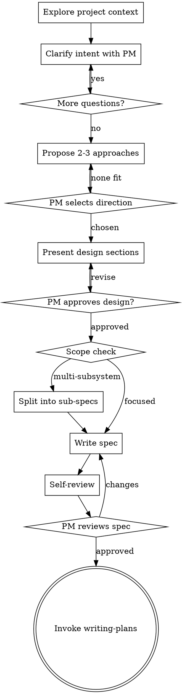

# Brainstorming

Turn the PM's intent into a design spec through collaborative dialogue. The PM decides what to build; the EM shapes feasibility, flags constraints, and proposes approaches. The output is a committed spec that feeds directly into `coordinator:writing-plans`.

**Announce at start:** "Using brainstorming to explore the design before we plan implementation."

<HARD-GATE>
Once brainstorming has started, do NOT invoke any implementation skill, write any code, scaffold any project, or dispatch any executor until the spec is written and PM-approved. The only exit from brainstorming is a completed spec that transitions to `coordinator:writing-plans`.

This gate is about finishing what you started. If the PM arrived with a clear spec, the EM can skip brainstorming entirely and go straight to writing-plans. But once you've started the design conversation, see it through.
</HARD-GATE>

## Rationalization Resistance

Good EMs design before they build. The design can be lightweight — a few sentences for genuinely simple work — but it must exist and be approved before implementation begins.

| Thought | Check yourself |
|---------|---------------|
| "This is simple enough to just start coding" | Simple-looking requests are where unexamined assumptions cause the most rework. Write a short spec. |
| "The PM already described exactly what they want" | Did they describe it precisely enough for a cold-start agent to implement it without questions? If not, the spec isn't done. |
| "This is just a minor tweak to existing work" | Minor tweaks that touch multiple files or change behavior need a spec. If it's truly one line, you wouldn't have invoked brainstorming. |
| "We already discussed this earlier in conversation" | Conversation context compacts. The spec is what survives. If the design isn't written down, it doesn't exist. |

## Process



**Terminal state:** The ONLY next step after brainstorming is `coordinator:writing-plans`. No other skill.

## Understanding Intent

<!-- BEGIN project-rag-preamble (synced from snippets/project-rag-preamble.md) -->
**If MCP tools matching `mcp__*project-rag*` are available in this session, prefer them over grep/Explore for any code-shaped lookup.** Symbol-shaped questions ("where is X defined", "find the function that does Y") → `project_cpp_symbol` / `project_semantic_search`. Subsystem-shaped questions ("how does X work") → `project_subsystem_profile`. Impact questions ("what breaks if I change X") → `project_referencers` with depth=2. Stale RAG still beats grep on structure. Fall through to grep/Explore only if RAG returns nothing AND staleness is plausible.
<!-- END project-rag-preamble -->

**Project context first.** Before reading source files or running searches, check accumulated knowledge — architecture atlas (`tasks/architecture-atlas/systems-index.md`), wiki guides (`docs/wiki/DIRECTORY_GUIDE.md` → relevant guides), repo map (`tasks/repomap.md`). These tell you what exists, how it's structured, and what decisions have already been made. Then read specific source files and recent commits to fill gaps. Know what exists before asking what to change.

**Clarifying questions:**
- One question per message. Break complex topics into sequential questions.
- Prefer multiple choice when the decision space is bounded. Open-ended when it isn't.
- The PM is a product-savvy partner. Probe for decision points and constraints — don't ask about basics they've likely already considered.
- Focus on: purpose, success criteria, constraints, integration points, edge cases.
- If the PM has already specified something clearly, acknowledge it and move to what's unresolved.

**Technical constraints:** If the EM sees a technical issue with the PM's direction, raise it directly. "That approach would require X, which conflicts with Y. Here's what I'd recommend instead." The EM's job is honest technical counsel, not silent compliance.

**Scope assessment:** If the request spans independent subsystems, flag this early. Each subsystem gets its own spec, plan, and execution cycle. Don't try to design everything in one pass — decompose first, then deep-dive each piece.

## Domain Language Discipline

If `CONTEXT.md` exists at the project root, read it before the first PM clarification question. If it is absent, proceed silently — do not flag, suggest, or scaffold. Use canonical terms in your questions. When the PM says a term that's on the `_Avoid_:` list, gently substitute the canonical term and confirm: *"You said X — you mean &lt;canonical-term&gt;?"*

When the PM resolves a term during dialogue (defines, disambiguates, or names a previously-fuzzy concept), update `CONTEXT.md` inline — don't batch. Use the format at `docs/wiki/context-md-convention.md`.

If `CONTEXT.md` doesn't exist and a term gets resolved that would clearly recur, lazily create it with the resolved term as the first entry. Never scaffold an empty file. If no term has been resolved yet, don't create the file.

## Exploring Approaches

- Propose 2-3 approaches with trade-offs. More than 3 creates decision paralysis.
- Lead with your recommendation and explain why.
- For each approach: one sentence on the idea, one on the key trade-off, one on when you'd choose it.
- If one approach is clearly superior, say so. The PM appreciates directness over false balance.
- If the PM's request implies an approach with a significant technical drawback, include it as an option but flag the drawback.

## Presenting the Design

- Scale each section to its complexity. A few sentences if straightforward, up to 200-300 words if nuanced.
- Ask after each section whether it looks right so far. Incremental approval, not monolithic review.
- Cover as applicable: architecture, components, data flow, interfaces, error handling, testing strategy.
- In existing codebases: follow established patterns. Include targeted improvements only where existing code directly affects the work.

## Writing the Spec

**Save to:** `docs/specs/YYYY-MM-DD-<topic>-design.md` (project directory). If the project has no `docs/` directory, create it.

The spec must carry enough context for a cold-start agent to implement the feature without conversation history.

**Self-review checklist** (flag issues that would cause problems during planning or execution — not style):
1. **Placeholder scan:** Any TBD, TODO, incomplete sections, or vague requirements? Fix them.
2. **Internal consistency:** Do sections contradict each other? Does the architecture match the requirements?
3. **Scope check:** Is this focused enough for a single plan? If it spans independent subsystems, split into separate specs now.
4. **Ambiguity check:** Could any requirement be interpreted two ways? Pick one and make it explicit.
5. **Glossary check:** If a term was resolved in dialogue, has `CONTEXT.md` been updated so downstream plan-writing will use the canonical form? (Missing this produces plans with the wrong term, which re-invites the conflation the glossary was built to prevent.)

Fix issues inline. No separate review pass needed.

**Commit the spec** before presenting it to the PM.

**PM review gate:**

> "Spec written and committed to `<path>`. Please review — I'll hold on implementation until you approve."

Wait for PM response. If changes requested, apply them and re-run self-review. Only proceed once the PM approves.

## Spec Template

```markdown
# [Feature Name] Design Spec

**Date:** YYYY-MM-DD
**Status:** Draft | PM-Approved
**Goal:** [One sentence — what does this build and why?]

## Context

[What exists today, what problem this solves, why now. 2-3 sentences.]

## Requirements

- [Requirement 1 — concrete, testable]
- [Requirement 2]

### Out of Scope

- [Thing we're NOT building and why]

## Design

### Architecture

[How the pieces fit together. Diagram if helpful.]

### Components

[For each: what it does, what it depends on, how it's tested.]

### Interfaces

[How components communicate. API contracts, data shapes, event flows.]

### Error Handling

[What can go wrong and how each failure mode is handled.]

## Trade-offs

| Decision | Chosen | Alternative | Why |
|----------|--------|-------------|-----|
| [Decision] | [Choice] | [Other option] | [Reasoning] |

## Testing Strategy

[How to verify this works. What's automated vs. manual.]

## Open Questions

[Anything unresolved. Should be empty before PM approval.]
```

## Transition

Once the PM approves the spec:

**REQUIRED SUB-SKILL:** Invoke `coordinator:writing-plans` to create the implementation plan. The spec file is the input. Do NOT invoke any other skill — `coordinator:writing-plans` is the only valid next step.
