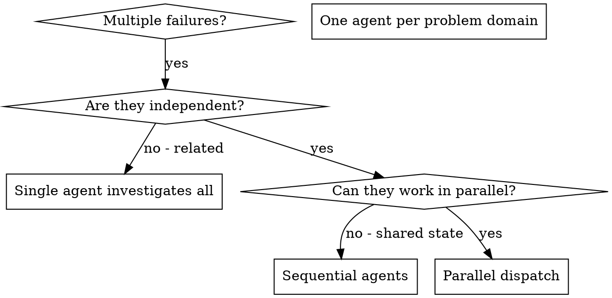

# Dispatching Parallel Agents

## Overview

When you have multiple unrelated failures (different test files, different subsystems, different bugs), investigating them sequentially wastes time. Each investigation is independent and can happen in parallel.

**Core principle:** Dispatch one agent per independent problem domain. Let them work concurrently.

## Concurrency Budget

**Hard cap: 6-8 concurrent background agents in a single dispatch wave.** Exceeding this risks platform-level crashes — each Opus orchestrator spawns sub-agents, so a wave of orchestrators can inflate to 200+ real agents under the hood.

**Rules:**
- If any agents in the wave are themselves orchestrators (Opus delegating to subagents), divide the budget by the expected fanout before dispatching. A wave of 4 orchestrators each spawning 6 sub-agents is a 24-agent wave, not a 4-agent wave.
- Use an explicit **pilot → expand ramp**: launch 4-6 agents, observe completion and stability, then expand to the next wave. Do not pre-schedule the full batch.
- Batches that would breach the cap (after fanout adjustment) are a **PM call, not an EM call** — the cost and stability tradeoffs belong at that level.

This rule is a heuristic calibrated from observed crash thresholds, not a platform-documented limit. Treat it as a ceiling, not a target.

## Anti-Pattern: Dedicated Mechanical-Merge Slots

**Do not allocate a team slot to an agent whose only job is dedup/concat/reformat.** Mechanical merge does not justify a team slot.

When an agent's entire brief is "take these N specialist outputs and combine them," fold that work into the producers (via adversarial peer alignment) or the consumer (the one with judgment — e.g., the Opus synthesizer or the EM directly). A team slot must justify itself with judgment work, not bookkeeping.

**Empirical basis:** In one measured pipeline run, the dedicated consolidator added 4+ minutes wall-clock and was beaten to completion by the downstream sweep that read raw specialist outputs directly.

If you find yourself writing a specialist brief that includes "then consolidate the outputs," stop and ask: does that consolidation require judgment (edge-case resolution, contradiction reconciliation, cross-domain synthesis)? If yes, give it to the consumer-with-judgment. If no, eliminate the role.

## Background by Default

**Any autonomous agent expected to run >2 minutes should be dispatched with `run_in_background: true`.** The EM gets notified on completion and processes results then — it doesn't need to block watching agent output scroll by.

This applies to:
- Enricher agents (10-15 min each)
- Executor agents (5-15 min each)
- Research scouts and verifiers (Haiku/Sonnet phases within pipelines)
- Top-level orchestrator agents (structured-research, architecture-audit)
- Code health reviewers

**Exceptions** (keep foreground):
- Agents whose results you need *immediately* to make the next decision (e.g., a quick Haiku lookup before choosing an approach)
- Agents in a strictly sequential pipeline where the next dispatch depends on the previous result AND you have no other work to do while waiting

When dispatching N independent agents in background, you'll be notified as each completes. Process results as they arrive — don't wait for all N before starting.

## When to Use



**Use when:**
- 3+ test files failing with different root causes
- Multiple subsystems broken independently
- Each problem can be understood without context from others
- No shared state between investigations

**Don't use when:**
- Failures are related (fix one might fix others)
- Need to understand full system state
- Agents would interfere with each other

## Worktree vs. Same-Worktree Dispatch

**Default: dispatch into the current worktree.** Do NOT create separate git worktrees for parallel agents unless there is a genuine need for branch-level isolation (e.g., separate PRs targeting different base branches).

**Decision rule:**
- **Disjoint file sets → parallel, same worktree.** Agents write to different files; the filesystem is the coordination mechanism. No merge ceremony needed.
- **Overlapping files → sequential, same worktree.** Run agents one after another so each sees the previous agent's changes. This is almost always cheaper than worktree creation + merge conflict resolution at agent execution speed.
- **Overlapping files with different insertion points** (e.g., appending to different sections of the same file) → still sequential. "Theoretically non-conflicting" edits in the same file are fragile; sequential execution eliminates the risk for negligible time cost.
- **True branch isolation needed** (different base branches, separate PRs, long-lived parallel features) → use worktrees via `coordinator:using-git-worktrees`.

**Why not worktrees by default?** Worktrees solve a human-scale problem: needing days of isolation on parallel features. At agent execution speed, the merge overhead (branch creation, conflict resolution, integration verification) exceeds the time saved by parallelism. Sequential execution on overlapping files is almost always the cheaper path.

## The Pattern

### 1. Identify Independent Domains

Group failures by what's broken:
- File A tests: Tool approval flow
- File B tests: Batch completion behavior
- File C tests: Abort functionality

Each domain is independent - fixing tool approval doesn't affect abort tests.

### 2. Create Focused Agent Tasks

Each agent gets:
- **Specific scope:** One test file or subsystem
- **Clear goal:** Make these tests pass
- **Constraints:** Don't change other code
- **Expected output:** Summary of what you found and fixed

### 3. Dispatch in Parallel

```typescript
// In Claude Code / AI environment
Task("Fix agent-tool-abort.test.ts failures")
Task("Fix batch-completion-behavior.test.ts failures")
Task("Fix tool-approval-race-conditions.test.ts failures")
// All three run concurrently
```

### 4. Review and Integrate

When agents return:
- Read each summary
- Verify fixes don't conflict
- Run full test suite
- Integrate all changes

## Agent Prompt Structure

Good agent prompts are:
1. **Focused** - One clear problem domain
2. **Self-contained** - All context needed to understand the problem
3. **Specific about output** - What should the agent return?

```markdown
Fix the 3 failing tests in src/agents/agent-tool-abort.test.ts:

1. "should abort tool with partial output capture" - expects 'interrupted at' in message
2. "should handle mixed completed and aborted tools" - fast tool aborted instead of completed
3. "should properly track pendingToolCount" - expects 3 results but gets 0

These are timing/race condition issues. Your task:

1. Read the test file and understand what each test verifies
2. Identify root cause - timing issues or actual bugs?
3. Fix by:
   - Replacing arbitrary timeouts with event-based waiting
   - Fixing bugs in abort implementation if found
   - Adjusting test expectations if testing changed behavior

Do NOT just increase timeouts - find the real issue.

Return: Summary of what you found and what you fixed.
```

## Common Mistakes

**❌ Too broad:** "Fix all the tests" - agent gets lost
**✅ Specific:** "Fix agent-tool-abort.test.ts" - focused scope

**❌ No context:** "Fix the race condition" - agent doesn't know where
**✅ Context:** Paste the error messages and test names

**❌ No constraints:** Agent might refactor everything
**✅ Constraints:** "Do NOT change production code" or "Fix tests only"

**❌ Vague output:** "Fix it" - you don't know what changed
**✅ Specific:** "Return summary of root cause and changes"

## When NOT to Use

**Related failures:** Fixing one might fix others — investigate together first
**Need full context:** Understanding requires seeing entire system
**Exploratory debugging:** You don't know what's broken yet
**Overlapping files:** Agents editing the same files — run sequentially instead (see Worktree vs. Same-Worktree Dispatch above)

## Real Example from Session

**Scenario:** 6 test failures across 3 files after major refactoring

**Failures:**
- agent-tool-abort.test.ts: 3 failures (timing issues)
- batch-completion-behavior.test.ts: 2 failures (tools not executing)
- tool-approval-race-conditions.test.ts: 1 failure (execution count = 0)

**Decision:** Independent domains - abort logic separate from batch completion separate from race conditions

**Dispatch:**
```
Agent 1 → Fix agent-tool-abort.test.ts
Agent 2 → Fix batch-completion-behavior.test.ts
Agent 3 → Fix tool-approval-race-conditions.test.ts
```

**Results:**
- Agent 1: Replaced timeouts with event-based waiting
- Agent 2: Fixed event structure bug (threadId in wrong place)
- Agent 3: Added wait for async tool execution to complete

**Integration:** All fixes independent, no conflicts, full suite green

**Time saved:** 3 problems solved in parallel vs sequentially

## Coordinator-Supervised Sequential Pattern

For chunks that are too large for any single executor but have natural seam boundaries, use the **coordinator-supervised sequential** pattern instead of pure parallel dispatch.

**When to use:**
- Stub has 10+ human-indexed hours of estimated work
- The work has natural seam boundaries (independent API endpoints, separable subsystems)
- Each sub-part is independently correct but the whole must cohere
- A single executor would run out of context

**The pattern — Opus tech lead with Sonnet executors:**
1. **Dispatch a dedicated Opus agent as tech lead** — not the coordinator itself. The coordinator's context is the scarcest resource in the system; don't fill it with sub-task orchestration for one deliverable. Think of it like an EM delegating to a senior technical lead rather than managing individual contributors directly.
2. The tech lead holds the full enriched spec and owns the deliverable:
   - Decomposes into sequential sub-tasks at seam boundaries
   - Dispatches Sonnet executors one at a time for each sub-task
   - Verifies each executor's output against the master spec before dispatching the next
   - Makes micro-decisions within the spec's intent without escalating
   - Can handle a complex sub-task directly if a Sonnet executor would struggle
3. The tech lead reports back to the coordinator with a single completion report
4. Escalation to coordinator only for: spec ambiguity, out-of-scope architectural decisions, or PM-level blockers

**Why not supervise from the coordinator directly?** The coordinator session may have many parallel workstreams, an ongoing PM conversation, and portfolio-level context. Routing every sub-task completion through that session fragments its attention on implementation minutiae. A dispatched Opus tech lead has fresh context, full focus on one deliverable, and the judgment to make micro-calls autonomously.

**When NOT to use this — use a single Sonnet executor instead:**
- The stub is small enough for one executor (the common case)
- The system is tightly coupled but the enriched spec has exact code sketches — a single Sonnet can follow a well-specified blueprint regardless of coupling
- If the spec is genuinely incomplete, fix the spec first or have the EM handle it directly — don't dispatch an Opus executor (see `/delegate-execution` Phase 2 rubric)

See `/delegate-execution` Phase 2 for the full model selection rubric.

## Key Benefits

1. **Parallelization** - Multiple investigations happen simultaneously
2. **Focus** - Each agent has narrow scope, less context to track
3. **Independence** - Agents don't interfere with each other
4. **Speed** - 3 problems solved in time of 1

## Verification

After agents return:
1. **Review each summary** - Understand what changed
2. **Check for conflicts** - Did agents edit same code?
3. **Run full suite** - Verify all fixes work together
4. **Spot check** - Agents can make systematic errors

<!-- Review: Patrik — removed duplicate Real-World Impact section (detailed version at lines 162-185) -->
