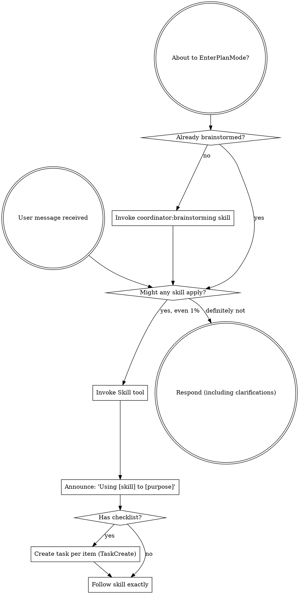

<SUBAGENT-STOP>
If you were dispatched as a subagent to execute a specific task, skip this skill.
</SUBAGENT-STOP>

<EXTREMELY-IMPORTANT>
If you think there is even a 1% chance a skill might apply to what you are doing, you ABSOLUTELY MUST invoke the skill.

IF A SKILL APPLIES TO YOUR TASK, YOU DO NOT HAVE A CHOICE. YOU MUST USE IT.

This is not negotiable. This is not optional. You cannot rationalize your way out of this.
</EXTREMELY-IMPORTANT>

## How to Access Skills and Commands

**Skills AND commands both use the `Skill` tool.** When you invoke either, its content is loaded and presented to you — follow it directly. Never use the Read tool on skill or command files.

**IMPORTANT — Always use the fully-qualified name.** Skills and commands are registered under their **plugin namespace** and MUST be invoked with the correct prefix. Bare names (e.g., `session-end`) will fail with "Unknown skill."

**Plugin prefixes** — use the prefix matching the plugin that owns the skill/command:

| Plugin | Prefix | Example invocation |
|--------|--------|--------------------|
| coordinator | `coordinator:` | `coordinator:session-start` |
| deep-research | `deep-research:` | `deep-research:deep-research` |
| notebooklm | `notebooklm:` | `notebooklm:notebooklm-research` |
| holodeck-control | `holodeck-control:` | `holodeck-control:ue-editor-control` |
| holodeck-docs | `holodeck-docs:` | `holodeck-docs:ue-docs-lookup` |

Non-plugin skills (e.g., `simplify`, `loop`) work without a prefix because they have no namespace.

**Commands** are dispatch workflows that run multi-phase agent pipelines. Invoke via the Skill tool with the correct plugin prefix (e.g., `Skill tool → skill: "coordinator:structured-research", args: "spec.yaml batch"`).

**Skills** are behavioral protocols that shape how you approach work. Invoke via the Skill tool with the correct plugin prefix.

## Instruction Priority

Coordinator skills override default system prompt behavior, but user instructions always take precedence:

1. **User's explicit instructions** (CLAUDE.md, direct requests) — highest priority
2. **Coordinator skills** — override default system behavior where they conflict
3. **Default system prompt** — lowest priority

# Using Skills

## The Rule

**Invoke relevant or requested skills BEFORE any response or action.** Even a 1% chance a skill might apply means that you should invoke the skill to check. If an invoked skill turns out to be wrong for the situation, you don't need to use it.

## Red Flags

These thoughts mean STOP—you're rationalizing:

| Thought | Reality |
|---------|---------|
| "This is just a simple question" | Questions are tasks. Check for skills. |
| "I need more context first" | Skill check comes BEFORE clarifying questions. |
| "Let me explore the codebase first" | Skills tell you HOW to explore. Check first. |
| "I can check git/files quickly" | Files lack conversation context. Check for skills. |
| "Let me gather information first" | Skills tell you HOW to gather information. |
| "This doesn't need a formal skill" | If a skill exists, use it. |
| "I remember this skill" | Skills evolve. Read current version. |
| "This doesn't count as a task" | Action = task. Check for skills. |
| "The skill is overkill" | Simple things become complex. Use it. |
| "I'll just do this one thing first" | Check BEFORE doing anything. |
| "This feels productive" | Undisciplined action wastes time. Skills prevent this. |
| "I know what that means" | Knowing the concept ≠ using the skill. Invoke it. |
| "Let me read the command file" | Commands are invoked via the Skill tool, not read via Read. Reading loses phase separation, template guardrails, and Haiku confabulation prevention. |
| "The command exists, I'll follow it manually" | Invoke it. `Skill tool → skill: "coordinator:structured-research", args: "spec.yaml batch"` — not Read + manual orchestration. Manual execution skips quality gates and scratch management. |
| `Skill(session-end)` — bare name | Always use the fully-qualified name: `coordinator:session-end`, `deep-research:deep-research`, `notebooklm:notebooklm-research`, etc. Bare names fail with "Unknown skill." |

## Skill Priority

When multiple skills could apply, use this order:

1. **Process skills first** (brainstorming, debugging) - these determine HOW to approach the task
2. **Implementation skills second** (frontend-design, mcp-builder) - these guide execution

"Let's build X" → brainstorming first, then implementation skills.
"Fix this bug" → debugging first, then domain-specific skills.

## Skill Types

**Rigid** (TDD, debugging): Follow exactly. Don't adapt away discipline.

**Flexible** (patterns): Adapt principles to context.

The skill itself tells you which.

## User Instructions

Instructions say WHAT, not HOW. "Add X" or "Fix Y" doesn't mean skip workflows.

## Available Commands (invoke via Skill tool as `coordinator:command-name`)

Commands are dispatch workflows — multi-phase agent pipelines invoked with one command. **Use the Skill tool to invoke them, not the Read tool.** Always use the `coordinator:` prefix.

### Session Lifecycle
| Command | When to Use |
|---------|-------------|
| `/session-start` | Beginning of any session — load context, check handoffs, choose work |
| `/session-end` | End of session — capture lessons, align docs, commit |
| `/handoff` | Ending a session mid-feature — save state for next session pickup |
| `/pickup [handoff-path]` | Resume from a handoff — load it and immediately continue the next steps. Relay race: grab the baton and run |
| `/workday-start` | Morning orientation — triage handoffs, surface staleness, align priorities |
| `/workday-complete` | End of day — update-docs + branch consolidation + health survey |

### Plan Execution
| Command | When to Use |
|---------|-------------|
| `/execute-plan <plan-path>` | PM approved a plan — execute it directly in-coordinator with write-ahead tracking |
| `/mise-en-place [--hibernate]` | Multiple ready items — autonomous batch execution, straight shot, optional overnight hibernate |
| `/delegate-execution [stubs]` | Enriched stubs ready — dispatch Sonnet executor agents for implementation |

### Research (cross-plugin — note prefixes)
| Command | Skill Invocation | When to Use |
|---------|-----------------|-------------|
| `/deep-research web <topic>` | `deep-research:deep-research-web` | Pipeline A: investigate a topic — Agent Teams, fire-and-forget |
| `/deep-research repo <path>` | `deep-research:deep-research-repo` | Pipeline B: study a repository — Haiku scouts, Sonnet analysts, Opus synthesis |
| `/deep-research` | `deep-research:deep-research` | Router — picks Pipeline A, B, or C based on args |
| `/structured-research <spec>` | `deep-research:deep-research-structured` | Pipeline C: batch research with schema-conforming output |
| `/notebooklm-research <topic>` | `notebooklm:notebooklm-research` | Pipeline D: media-rich research via NotebookLM (YouTube, podcasts, audio) |

### Collaborative Planning & Review (Agent Teams)
| Command | When to Use |
|---------|-------------|
| `/staff-session --mode plan --tier standard\|full <objectives>` | **Multi-perspective planning** — domain experts (Patrik, Sid, Camelia, etc.) debate, Zolí synthesizes with ambition lens. Standard = 2 debaters; Full = 3-5 debaters |
| `/staff-session --mode review --tier standard\|full <artifact>` | **Multi-perspective review** — same debate structure but critiquing an existing artifact. Zolí synthesizes findings, challenges conservative scope-downs |
| `/staff-session --mode review --tier lightweight <artifact>` | Falls through to `/review-dispatch` — single reviewer, no team created |

### Code Quality & Architecture
| Command | When to Use |
|---------|-------------|
| `/review-dispatch` | Route work to the right reviewer (Patrik, Sid, Camelia, Pali, Fru) |
| `/bug-sweep [path]` | Codebase has been churning — dispatch agents to scan, fix AI-fixable bugs, defer rest |
| `/code-health` | End of day or health check — review commits since last check, dispatch reviewer, update ledger |
| `/architecture-audit [--refresh]` | First time in a codebase or deep refresh — multi-phase atlas generation |
| `/architecture-rotation [system]` | Weekly rotation — pick highest-priority system, dispatch auditors |

### Documentation & Maintenance
| Command | When to Use |
|---------|-------------|
| `/update-docs [--no-distill]` | Sync documentation, commit, push to branch. Auto-chains `/distill` when artifact thresholds are met (skip with `--no-distill`) |
| `/generate-repomap` | Generate ranked repository map for LLM context |
| `/enrich-and-review` | Run enrichment pipeline on chunk directories |
| `/distill [--dry-run] [--no-delete] [path]` | Extract knowledge from accumulated artifacts into wiki docs, then delete source material |

## Available Skills (invoke via Skill tool as `coordinator:skill-name`)

Skills are behavioral protocols — they shape how you think about and approach work. Unlike commands, skills don't run pipelines automatically; they guide your behavior.

### Thinking & Planning
- **coordinator:brainstorming** — PM asks for a new feature or capability — structured exploration of intent, requirements, and design before any implementation
- **coordinator:writing-plans** — Requirements are clear and the task needs decomposition — breaks work into executable chunks with dependency ordering and effort estimates
- **coordinator:verification-before-completion** — About to claim work is done — requires evidence before assertions
- **coordinator:stuck-detection** — Self-monitoring protocol for detecting repetition, oscillation, analysis paralysis (injected into agent prompts, not invoked directly)

### Development Discipline
- **coordinator:test-driven-development** — RED-GREEN-REFACTOR cycle before writing implementation code
- **coordinator:systematic-debugging** — Something's broken and you don't know why — root-cause investigation: reproduce, trace, identify, verify before proposing any fix
- **coordinator:dispatching-parallel-agents** — Pattern for dispatching 2+ independent tasks in parallel
- **coordinator:requesting-staff-session** — Agent Teams collaborative planning and review. Guides when to use `/staff-session` vs `/review-dispatch`, tier selection (lightweight/standard/full), team composition (auto or explicit persona selection), plan mode vs review mode

### Code Review
- **coordinator:requesting-code-review** — Routes to `/review-dispatch` — how to prepare work for review
- **coordinator:receiving-code-review** — How to receive and act on feedback with technical rigor, not performative agreement
- **coordinator:requesting-staff-session** — For multi-perspective review with debate: `/staff-session --mode review`. Use when a single reviewer isn't enough — persona agents debate the artifact and produce synthesized findings. See the Collaborative Planning & Review command table above for invocation details.

### Git & Branching
- **coordinator:using-git-worktrees** — Isolated workspaces per feature (for separate PRs, different base branches)
- **coordinator:finishing-a-development-branch** — Implementation complete — guides completion options (merge, PR, cleanup)
- **coordinator:merging-to-main** — Creates PR, waits for CI, merges, cleans up. Also invocable via `/workday-complete`

### Pipeline Definitions (reference material for commands)

These directories contain pipeline definitions (`PIPELINE.md`) that the corresponding commands execute. They are NOT separately invocable — use the command. To understand a pipeline's design, read its `PIPELINE.md` file directly.

| Command | Pipeline Definition |
|---------|-------------------|
| `/execute-plan` | `pipelines/executing-plans/PIPELINE.md` |
| `/mise-en-place` | `pipelines/mise-en-place/PIPELINE.md` |
| `/bug-sweep` | Self-contained (pipeline absorbed into command) |
| `/architecture-audit` | Self-contained (references `pipelines/deep-architecture-audit/agent-prompts.md` for dispatch templates) |
| `/architecture-rotation` | `pipelines/weekly-architecture-audit/PIPELINE.md` |
| `/code-health` | `pipelines/daily-code-health/PIPELINE.md` |
| `/deep-research` | `deep-research` plugin — `pipelines/PIPELINE.md` |
| `/structured-research` | `pipelines/deep-research/PIPELINE-C.md` |
| `/staff-session` | `pipelines/staff-session/` (team-protocol, planner/reviewer/synthesizer prompt templates) |
| `/distill` | `pipelines/artifact-distillation/PIPELINE.md` |

### Maintenance
- **coordinator:debt-triage** — EM-PM conversation about the debt backlog — not a dispatch pipeline
- **coordinator:validate** — Run all CI validation checks locally
- **coordinator:tracker-maintenance** — Maintain the project tracker — archive completed work, update dependencies, sweep for untracked commits
- **coordinator:lessons-trim** — Trim stale entries from lessons files, merge duplicates, clean up feature-scoped files
- **coordinator:handoff-archival** — Archive consumed handoffs — chain-aware supersession pass + 48-hour time-based sweep
- **coordinator:artifact-consolidation** — Bulk prune accumulated plans, archived handoffs, and stale task dirs. Dry-run first, PM approves before deletion.
- **coordinator:atlas-integrity-check** — Check changed files against the architecture atlas for unmapped entries
- **coordinator:project-onboarding** — Bootstrap a new project's tracking infrastructure — tracker, tasks, archive, handoffs. Use when starting a new project or when /update-docs reports missing tracker.

### Meta
- **coordinator:writing-skills** — TDD applied to skill/documentation authoring
- **coordinator:skill-discovery** — This skill — how to find and use skills and commands
