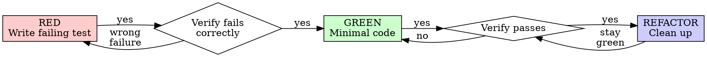

# Test-Driven Development

## Overview

Write the test first. Watch it fail. Write minimal code to pass.

**Core principle:** If you didn't watch the test fail, you don't know if it tests the right thing.

**Violating the letter of the rules is violating the spirit of the rules.**

## When to Use

**Always:** new features, bug fixes, refactoring, behavior changes.

**Exceptions (ask the PM):** throwaway prototypes, generated code, configuration files.

Thinking "skip TDD just this once"? Stop. That's rationalization.

## The Iron Law

```
NO PRODUCTION CODE WITHOUT A FAILING TEST FIRST
```

Wrote code before the test? Delete it. Start over. No exceptions: don't keep it as "reference," don't "adapt" it while writing tests, don't look at it. Implement fresh from tests.

## Red-Green-Refactor



### RED — Write Failing Test

One minimal test, one behavior, clear name, real code (no mocks unless unavoidable).

<Good>
```typescript
test('retries failed operations 3 times', async () => {
  let attempts = 0;
  const operation = () => {
    attempts++;
    if (attempts < 3) throw new Error('fail');
    return 'success';
  };
  const result = await retryOperation(operation);
  expect(result).toBe('success');
  expect(attempts).toBe(3);
});
```
</Good>

<Bad>
```typescript
test('retry works', async () => {
  const mock = jest.fn().mockRejectedValueOnce(...).mockResolvedValueOnce('success');
  await retryOperation(mock);
  expect(mock).toHaveBeenCalledTimes(3);
});
// Vague name, tests mock not code
```
</Bad>

### Verify RED — Watch It Fail (MANDATORY)

```bash
npm test path/to/test.test.ts
```

Confirm: test fails (not errors), failure message expected, fails because feature missing (not typos). Test passes? You're testing existing behavior — fix the test. Test errors? Fix the error and re-run until it fails correctly.

### GREEN — Minimal Code

Simplest code to pass the test. Don't add features, refactor other code, or "improve" beyond the test.

```typescript
async function retryOperation<T>(fn: () => Promise<T>): Promise<T> {
  for (let i = 0; i < 3; i++) {
    try { return await fn(); }
    catch (e) { if (i === 2) throw e; }
  }
  throw new Error('unreachable');
}
```

Don't pre-add `options?: { maxRetries?, backoff?, onRetry? }` — YAGNI.

### Verify GREEN (MANDATORY)

Test passes, other tests still pass, output pristine. Test fails? Fix code, not test. Other tests fail? Fix now.

### REFACTOR

After green: remove duplication, improve names, extract helpers. Keep tests green. Don't add behavior.

### Repeat

Next failing test for the next feature.

## Good Tests

| Quality | Good | Bad |
|---------|------|-----|
| Minimal | One thing. "and" in name? Split it. | `test('validates email and domain and whitespace')` |
| Clear | Name describes behavior | `test('test1')` |
| Shows intent | Demonstrates desired API | Obscures what code should do |

## Why Order Matters

**Tests-after pass immediately**, which proves nothing — might test the wrong thing, the implementation rather than behavior, or miss edge cases. Test-first forces you to see the test fail, proving it tests something.

**Tests-after answer "what does this do?"** Tests-first answer "what should this do?" Tests-after are biased by your implementation. Tests-first force edge case discovery before implementing.

For the full rationalization counter-arguments (sunk-cost fallacy on rewrites, manual-testing-is-systematic claims, "TDD is dogmatic" rebuttals), see `tdd-rationalizations.md` adjacent or the wiki guide.

## Common Rationalizations

| Excuse | Reality |
|--------|---------|
| "Too simple to test" | Simple code breaks. Test takes 30 seconds. |
| "I'll test after" | Tests passing immediately prove nothing. |
| "Already manually tested" | Ad-hoc ≠ systematic. No record, can't re-run. |
| "Deleting X hours is wasteful" | Sunk cost. Keeping unverified code is technical debt. |
| "Keep as reference, write tests first" | You'll adapt it. That's testing-after. Delete means delete. |
| "Test hard = design unclear" | Listen to the test. Hard to test = hard to use. |
| "TDD will slow me down" | TDD is faster than debugging. |
| "Existing code has no tests" | You're improving it. Add tests now. |

## Red Flags — STOP and Start Over

Code before test. Test after implementation. Test passes immediately. Can't explain why test failed. Tests added "later." Rationalizing "just this once." "Keep as reference" or "adapt existing code." "Already spent X hours, deleting is wasteful." "TDD is dogmatic, I'm being pragmatic." "This is different because..."

All of these mean: delete the code, start over with TDD.

## Example: Bug Fix

**Bug:** empty email accepted.

**RED**
```typescript
test('rejects empty email', async () => {
  const result = await submitForm({ email: '' });
  expect(result.error).toBe('Email required');
});
```
`FAIL: expected 'Email required', got undefined` ✓

**GREEN**
```typescript
function submitForm(data: FormData) {
  if (!data.email?.trim()) return { error: 'Email required' };
  // ...
}
```
`PASS` ✓

## Verification Checklist

Before marking work complete:
- [ ] Every new function/method has a test
- [ ] Watched each test fail before implementing
- [ ] Each test failed for expected reason (feature missing, not typo)
- [ ] Wrote minimal code to pass
- [ ] All tests pass; output pristine
- [ ] Tests use real code (mocks only if unavoidable)
- [ ] Edge cases and errors covered

Can't check all boxes? You skipped TDD. Start over.

## When Stuck

| Problem | Solution |
|---------|----------|
| Don't know how to test | Write the wished-for API. Write the assertion first. Ask the PM. |
| Test too complicated | Design too complicated. Simplify interface. |
| Must mock everything | Code too coupled. Use dependency injection. |
| Test setup huge | Extract helpers. Still complex? Simplify design. |

## Debugging Integration

Bug found? Write failing test reproducing it. Follow TDD cycle. Test proves fix and prevents regression. Never fix bugs without a test.

## Testing Anti-Patterns

When adding mocks or test utilities, read `@testing-anti-patterns.md`:
- Testing mock behavior instead of real behavior
- Adding test-only methods to production classes
- Mocking without understanding dependencies

## Final Rule

```
Production code → test exists and failed first
Otherwise → not TDD
```

No exceptions without the PM's permission.
